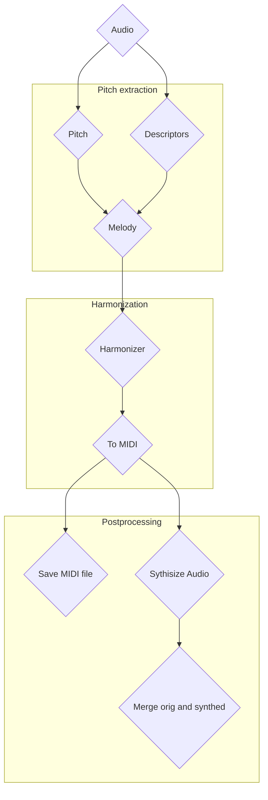

# Song-ify

A generative music system for adding accompaniment to voice, particularly for spoken word, developed during the [Generative Music AI Workshop (2025)](https://www.upf.edu/web/mtg/generative-music-ai-workshop) in the Music Technology Group at Universitat Pompeu Fabreu in Barcelona.

The system uses a variety of techniques from digital signal processing, music theory and generative AI to extract a melody from the spoken voice, then suitably harmonise that melody in a way which adds value to the original content.

## Stages

### Melody Extraction

### Accompaniment Generation
