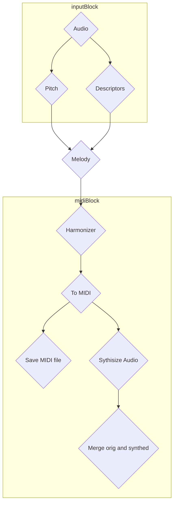

# GenMusPianoAccompaniment

A system for generating musical accompaniment to voice, whether sung, spoken or otherwise.

## Stages

```mermaid
flowchart TD
    A{Audio}-->P{Pitch}
    A-->D{Descriptors}
    P-->M{Melody}
    D-->M
    M-->H{Harmonizer}
    H-->T{To MIDI}
    T-->S{Save MIDI file}
    T-->AD{Sythisize Audio}
    AD-->ME{Merge orig and synthed}

    %% Highlight input section
    subgraph inputBlock
        A
        P
        D
    end

    %% Highlight MIDI generation section
    subgraph midiBlock
        H
        T
        S
        AD
        ME
    end

    %% Define styling for blocks
    classDef inputBlock fill:#e3f2fd,stroke:#1e88e5,stroke-width:2px,rx:8,ry:8;
    classDef midiBlock fill:#fce4ec,stroke:#d81b60,stroke-width:2px,rx:8,ry:8;
```

### Melody Extraction

### Accompaniment Generation
